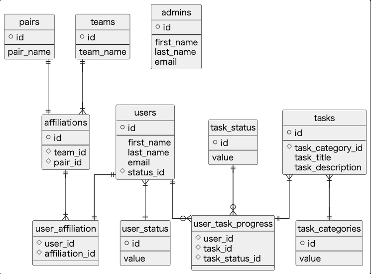
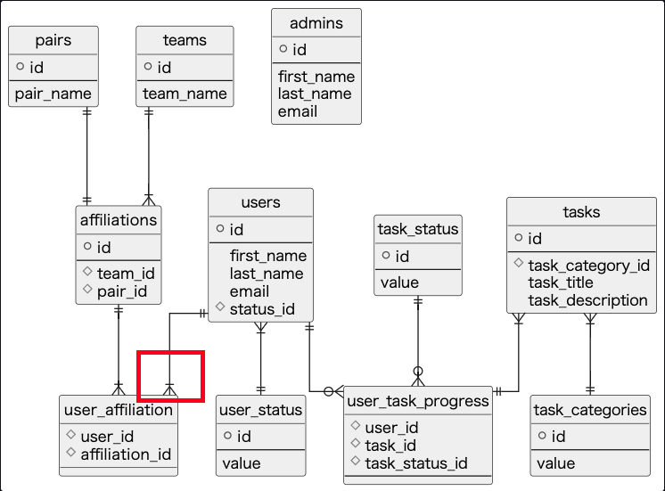

**現在のスキーマ：**



**移行後のスキーマ：**



---

コード修正のみでスキーマ移行の必要がなさそうな件

正規化徹底してくれた過去の自分最高 🥲

**一応簡易版で雰囲気はマネゴトしておく・・・（以下手順書とします ↓）**

---

# 目的

◯◯ なニーズを受け、ユーザーが複数ペアへ所属する機能を実装する。

そのためのマイグレーションを行う。

# 問い合わせ先

| 責任者   | ワイキキ・住む夫            |
| -------- | --------------------------- |
| 電話番号 | 0120-444-444                |
| メール   | waikiki-sumuo@surf-tech.com |

# 予想所要時間

約 30 分程度

# 概要

Expand and contract pattern (※) のステップごとに「実行手順」セクションに列挙したコマンドを実行していきます。

**(※ [Expand and contract pattern](https://www.prisma.io/dataguide/types/relational/expand-and-contract-pattern))**

**Step1: 新しいスキーマの実装とデプロイ**

**Step2: インターフェイスを拡張する**

**Step3: データを移行する**

**Step4: テスト**

**Step5: 新しいスキーマから読み込みを行うように切り替える**

**Step6: 旧スキーマへの書き込みを停止する**

**Step7: 旧スキーマの削除**

# 実行手順

## 前提

### 1. 開始報告

サーフィンを辞めて陸地で待機するため、責任者への開始報告をお願いいたします。

### 2. 本番環境への接続方法

```bash
# SSH接続
$ ssh -i ${key-file}.pem ${server-name}

# 対象ディレクトリへ移動
$ cd ${path}
```

## 実作業

### 0. 実装

Expand and contract pattern に基づき１ステップずつ実装を行なっていると仮定します。

### 1. （データ変更を加える場合）バックアップを作成

```bash
# DBサーバー（詳細なコマンドは自信なし・・・）
$ pg_dump ${dbname} > ${dump-name}.dump
```

### 2. マイグレーション実行

```bash
# アプリケーションサーバー
$ npx prisma generate deploy
```

- **もしも失敗した場合：**

  1. ロールバックを行う

     ```bash
     # アプリケーションサーバー
     $ npx prisma migrate down ${n} --experimental
     ```

  2. （データを復元したい場合）バックアップから DB をリストア

     ```bash
     # DBサーバー（詳細なコマンドは自信なし・・・）
     $ dropdb ${dbname}
     $ pg_restore -C ${dump-name}.dump
     ```

### 3. PrismaClient へのスキーマ反映

```bash
# アプリケーションサーバー
$ npx prisma generate
```

### 4. データが更新されたことを確認

```bash
# DBサーバー
$ use ${table-name};
$ SHOW COLUMNS FROM ${table-name};
```

## 終了

### 完了報告（おわり）

サーフィンに戻るため終了報告をお願いいたします。

# 参照資料

[Chapter 26. Backup and Restore](https://www.postgresql.org/docs/current/backup.html)
